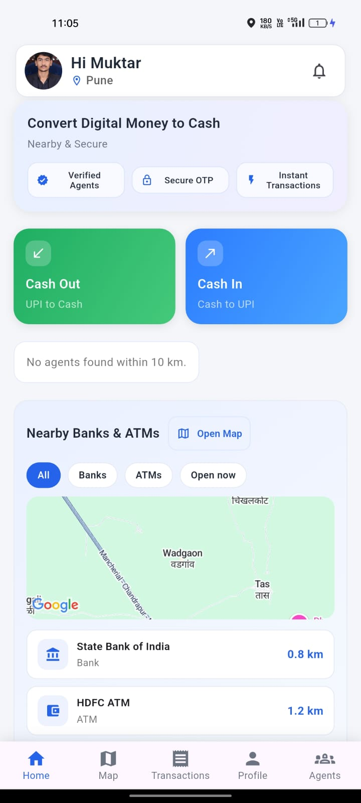
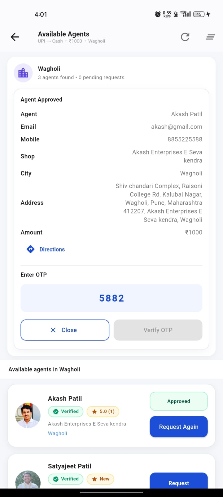
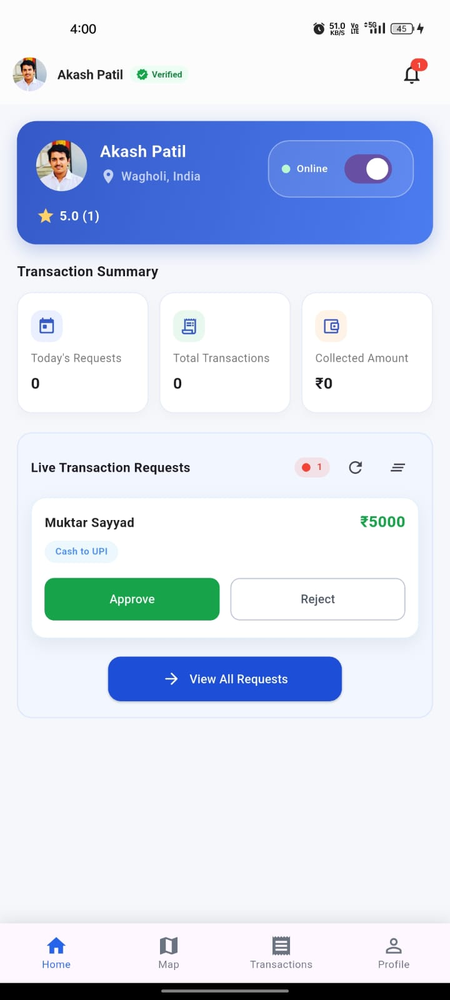
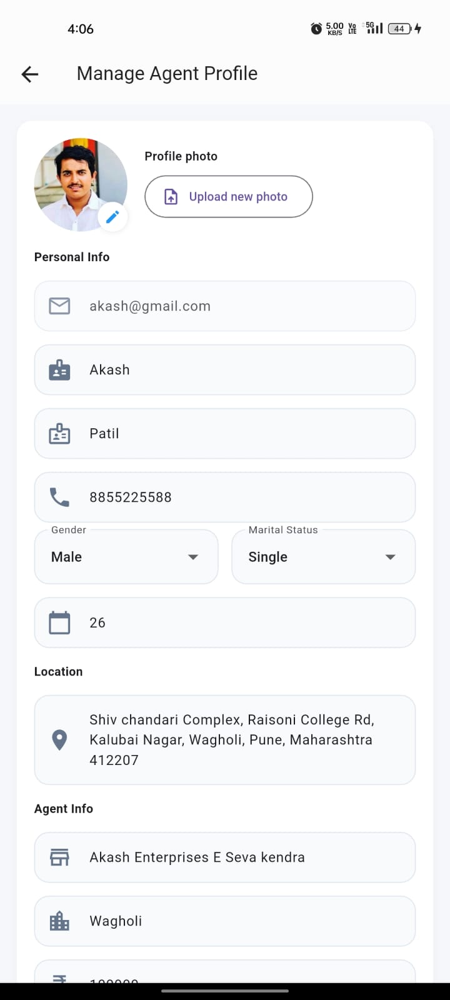
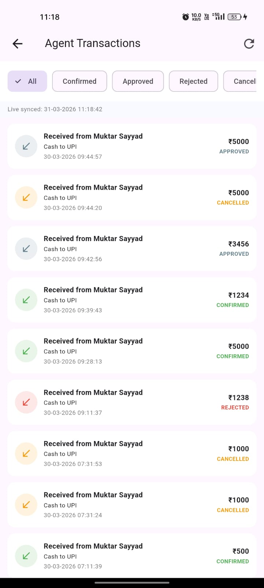
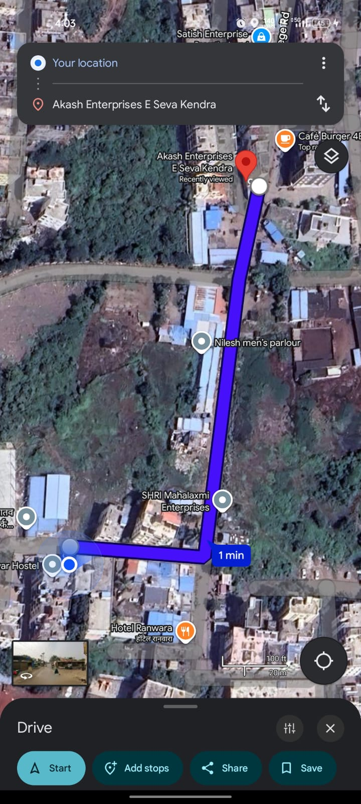
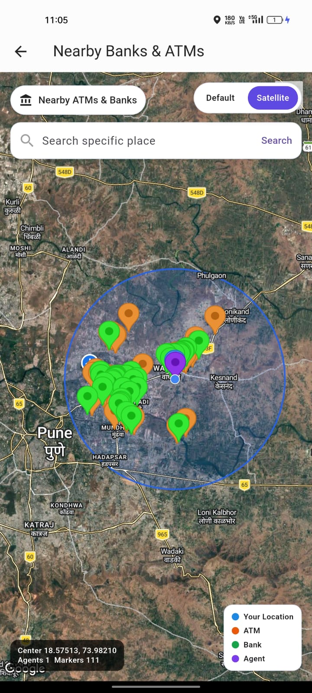
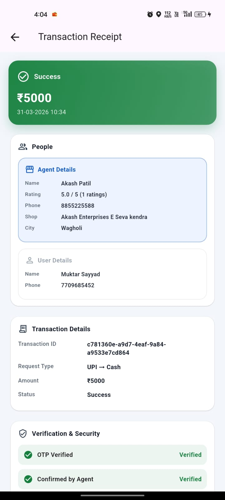
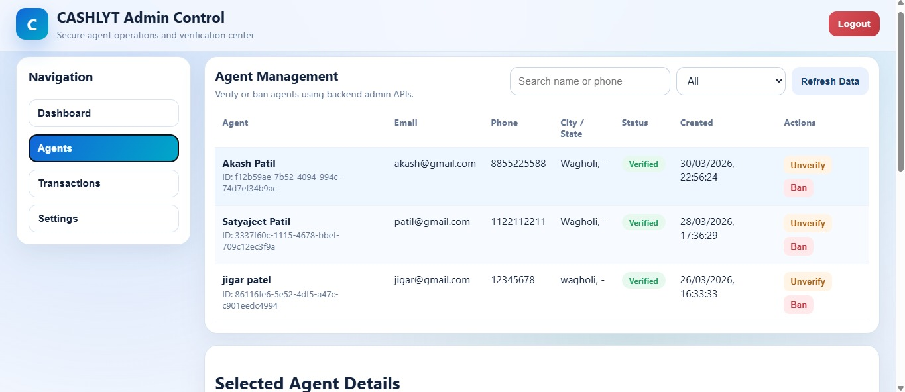

# PayBridge 💸🤝

## 📌 About the Project
PayBridge is a full-stack platform designed to connect users with nearby verified agents to solve real-world money conversion problems.

Unlike traditional payment apps, PayBridge does NOT process payments directly.  
Instead, it acts as a **secure intermediary bridge** between users and agents.

This makes transactions:
- More flexible  
- More accessible  
- Less dependent on digital-only systems  

---

## 🌍 Real-World Use Case
Many users struggle when:
- They need cash but only have UPI  
- They need digital money but only have cash  
- They cannot find trusted agents nearby  

👉 PayBridge solves this by connecting them with **verified agents**.

---

## 🚀 Key Features

- 👤 Separate User & Agent roles  
- 🧑‍💼 Verified Agent System  
- 📍 Map-based agent discovery (Google Maps integration)  
- 💬 Direct interaction system  
- 📊 Transaction history tracking  
- 🔔 Notifications system  
- 🔐 Secure authentication (JWT + bcrypt)  
- 🔢 OTP-based transaction verification  
- ⭐ Agent rating system  
- 🛠️ Admin control (approve / ban agents)  

---

## 🛠️ Tech Stack

### Backend
- Node.js  
- Express.js  
- TypeScript  
- Prisma ORM  

### Database
- PostgreSQL  

### Mobile App
- Flutter  

### Admin Panel
- HTML, CSS, JavaScript  

### Testing
- Vitest  
- Supertest  

### External Services
- Google Maps API  
- Nodemailer  

---

## ⚙️ How It Works

1. User logs into the system  
2. Searches for nearby agents  
3. Selects a verified agent  
4. Sends request for money conversion  
5. OTP verification ensures secure transaction  
6. User and agent complete the exchange  
7. Transaction history is stored  

---

## 📁 Project Structure

```
PayBridge/
├── backend/backend/
├── mobile_app/
├── admin/
├── screenshots/
└── README.md
```

---

## 📸 Screenshots

### 👤 User Experience

<div align="center">
  
  
  
</div>

<p align="center">
User Dashboard | Login | Available Agents
</p>

---

### 🧑‍💼 Agent Experience

<div align="center">
  
  
  
</div>

<p align="center">
Agent Dashboard | Profile | Transaction History
</p>

---

### 🔄 User & Agent Interaction

<div align="center">
  
  
  
</div>

<p align="center">
Map Navigation | Agent Location | Transaction Receipt
</p>

---

### 🖥️ Admin Dashboard

<div align="center">
  
</div>

<p align="center">
Complete Admin Dashboard Overview
</p>

---

## 🔌 API Endpoints

### Health
```
GET /health
```

### Auth
```
POST /auth/register
POST /auth/login
```

### Transactions
```
Create request
Match agents
Verify OTP
```

### Admin
```
Approve / Ban agents
```

---

## 🔐 Security

- JWT authentication  
- OTP verification  
- Role-based access  
- Secure APIs  

---

## ⚙️ Environment Variables

```
PORT=4000
DATABASE_URL=your_db_url
JWT_SECRET=your_secret
JWT_EXPIRY=expiry
NODE_ENV=development
GOOGLE_MAPS_API_KEY=your_key
ADMIN_REGISTRATION_CODE=your_code
```

---

## 🚀 Setup

```bash
cd backend/backend
npm install
npm run setup
npm run dev
```

Backend runs at:
```
http://localhost:4000
```

---

## 📊 Status

🚧 Work in progress  
✔ Core features working  

---

## 📈 Future Improvements

- AI agent matching  
- Fraud detection  
- Multi-country support  
- Better UI  

---

## 👨‍💻 Author

Mukhtar Sayyed  

---

## ⭐ Contribution

Open for contributions  

---

## 📄 License

MIT License
