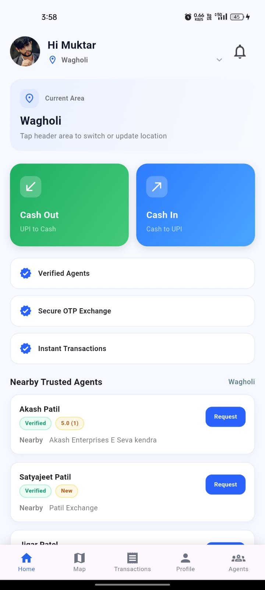
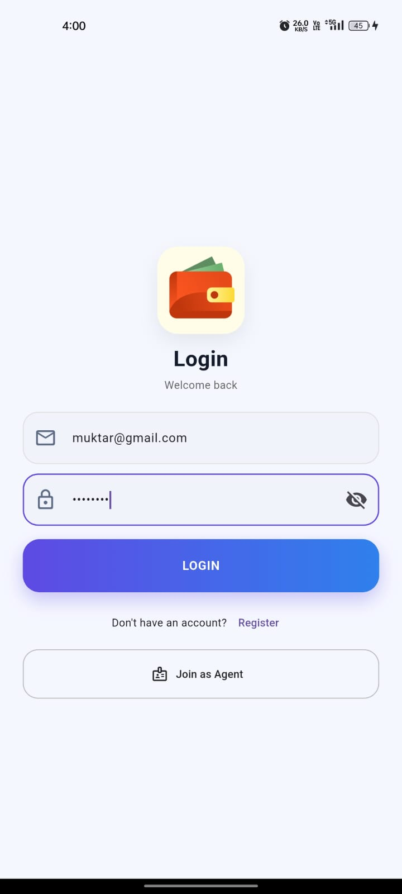

# PayBridge 💸🤝

## 📌 About the Project
PayBridge is a full-stack platform designed to connect users with nearby verified agents to solve real-world money conversion problems.

Unlike traditional payment apps, PayBridge does NOT process payments directly.  
Instead, it acts as a **secure intermediary bridge** between users and agents.

This makes transactions:
- More flexible  
- More accessible  
- Less dependent on digital-only systems  

---

## 🌍 Real-World Use Case
Many users struggle when:
- They need cash but only have UPI  
- They need digital money but only have cash  
- They cannot find trusted agents nearby  

👉 PayBridge solves this by connecting them with **verified agents**.

---

## 🚀 Key Features

- 👤 Separate User & Agent roles  
- 🧑‍💼 Verified Agent System  
- 📍 Map-based agent discovery  
- 💬 Direct interaction system  
- 📊 Transaction history tracking  
- 🔔 Notifications system  
- 🔐 Secure authentication & backend  

---

## 🛠️ Tech Stack

- Backend: Node.js, Express, TypeScript  
- Database: PostgreSQL + Prisma  
- Mobile App: Flutter  
- Admin Panel: HTML, CSS, JavaScript  

---

## ⚙️ How It Works

1. User logs into the system  
2. Searches for nearby agents  
3. Selects a verified agent  
4. Connects and resolves money conversion  
5. Tracks transaction history  

---

## 📸 Screenshots

### 👤 User Experience

<div align="center">
  
  
  
</div>

<p align="center">
User Dashboard | Login | Available Agents
</p>

---

### 🧑‍💼 Agent Experience

<div align="center">
  
  
  
</div>

<p align="center">
Agent Dashboard | Profile | Transaction History
</p>

---

### 🛠️ Admin Panel

<div align="center">
  
  
  
</div>

<p align="center">
Admin Management | Transactions | Notifications
</p>

---

## 🔐 Security

- Verified agent onboarding  
- Authentication & authorization  
- Secure APIs  
- Controlled communication  

---

## 📈 Future Improvements

- 🤖 AI-based agent matching  
- 🌐 Multi-country support  
- 📱 Improved mobile UI  
- 🔍 Fraud detection system  

---

## 🚀 Setup

```bash
cd backend/backend
npm run setup
npm run dev
